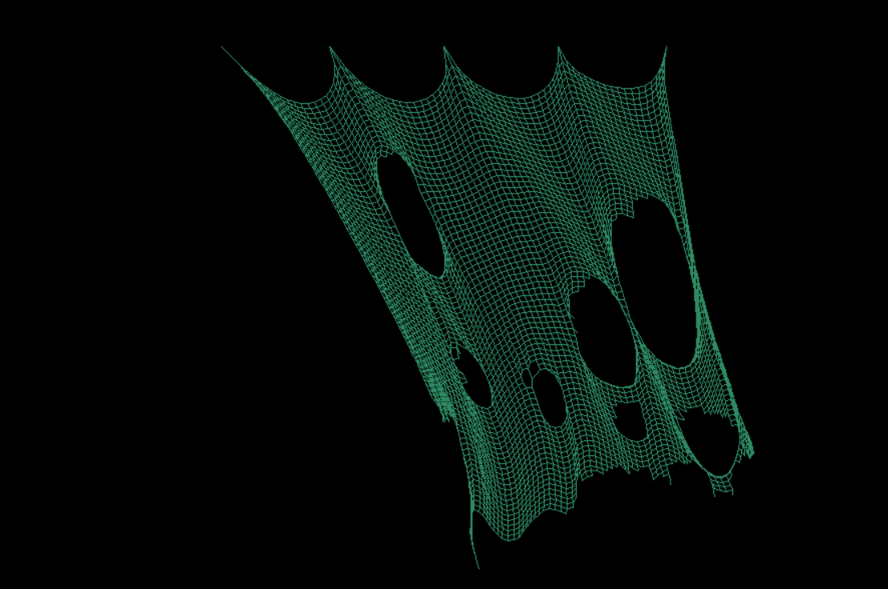

# clothsim - Cloth Simulation in C

A simple mass–spring based cloth simulation written in **C** using **SDL2** for visualization.
This project explores basic physics modeling, numerical integration, and constraint solving to simulate a deformable fabric in real time.

---

## Overview

This simulation models a grid-based cloth model using **Verlet integration** for particle motion. Each vertex (particle) stores its current and previous positions, with velocity implicitly encoded in their difference. Fibres act as distance constraints, maintaining rest lengths between adjacent nodes through positional correction. Constraint breaking enables cloth tearing by removing links in the 2D grid.

Pinned particles enforce boundary conditions, anchoring the mesh. **Gravitational and Wind force** is modeled as a constant acceleration, while mouse interaction injects external forces by modifying historical positions. A simple projection solver enforces constraints, distributing error between connected nodes.

Particles are clamped to the simulation bounds to prevent escape, and rendering is performed with **SDL2** immediate primitives, drawing fibres as line segments and vertices as points. The result is a lightweight, position-based dynamics system that is stable, extensible, and visually demonstrative of cloth-like behavior.

---

## Demo



Cloth Simulation in action on my website : https://m16.neocities.org/clothsim

---

## Features

* Mass–spring system with configurable grid size and stiffness
* Gravity, damping, and tearing behavior
* Real-time visualization using SDL2
* Simple mouse-based interaction
* Clear separation between physics update and rendering code

---

## Concepts Explored

* Vector math and time-step integration
* Constraint satisfaction and spring force computation
* Numerical stability trade-offs in explicit integration
* Low-level memory and performance considerations in C

---

## Dependencies

* **C compiler** (tested on GCC/Clang)
* **SDL2** (for rendering and input)

---

## Build Instructions

```bash
gcc cloth_sim.c -lSDL2 -lm -o cloth_sim
./cloth_sim
```

---

## 📘 Notes

This project is part of my exploration into **low-level physics and graphics simulation**, aimed at understanding how real-time systems model natural phenomena from scratch.

---
